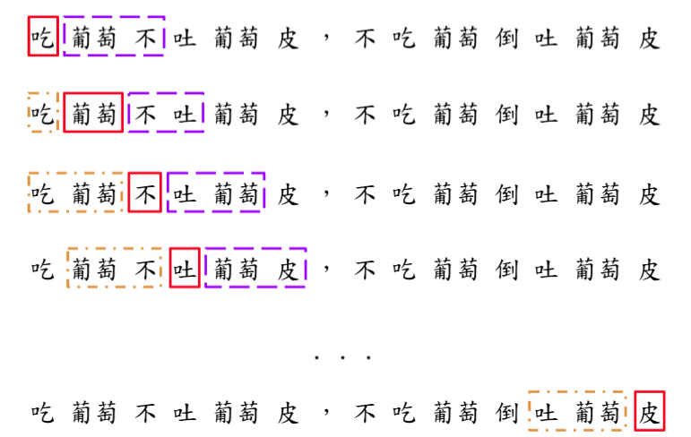

The Basics
===========


## Citation

Citations could be added and formatted with [pandoc-citeproc][cite]. See
@dunning1993 for instance.


## Figures

To properly display figures, figure paths should be specified 
**relative to** `index.html`. Hence, manipulation of the `figures/` directory
may be needed in the build script[^2].

{#fig:ref-label}


You can refer to the figure with [pandoc-crossref][pd-crf]'s syntax: see 
@fig:ref-label. To customized the prefix of figure (and table) captions, 
modify the YAML header in `pd-styles/variables.md`. Refer to 
[pandoc-crossref][pd-crf]'s documentation for the meaning of the variables


[cite]: https://github.com/jgm/pandoc-citeproc
[pd-crf]: https://github.com/lierdakil/pandoc-crossref

[^2]: For instance, the figure directory (`chapters/figures`) could be copied
to the same directory where `index.html` is found.
    
    ```bash
    cp -r chapters/figures .
    ```
